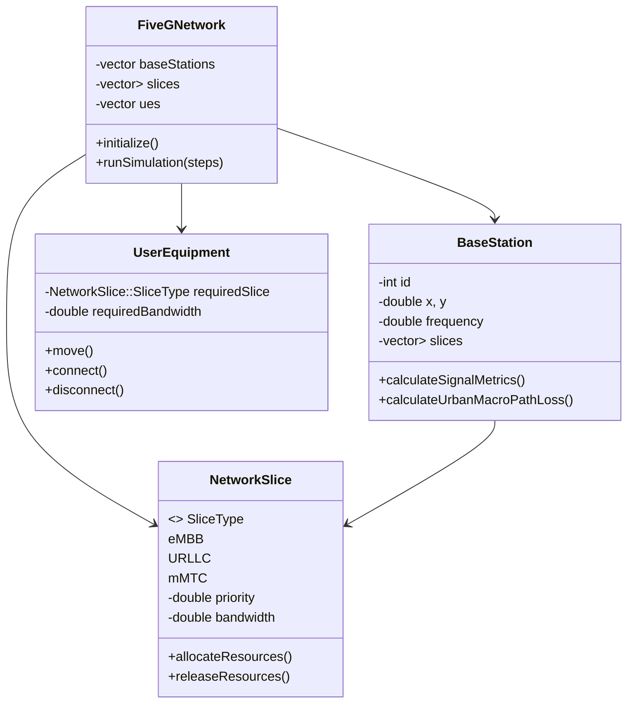

# 5G Network Simulation Framework

A C++ simulation framework for modeling 5G network components including base stations, network slicing, and user equipment mobility with quality-of-service metrics.

## Table of Contents
- [Features](#features)
- [System Architecture](#system-architecture)
- [Installation](#installation)
- [Usage](#usage)
- [Simulation Parameters](#simulation-parameters)
- [Output Metrics](#output-metrics)
- [Future Enhancements](#future-enhancements)
- [License](#license)

## Features

- **Realistic 5G Channel Modeling**:
  - Path loss calculations for both Sub-6 GHz and mmWave frequencies
  - Log-normal shadowing for signal fading
  - SINR and RSRP signal quality metrics

- **Network Slicing Implementation**:
  - Three slice types: eMBB (enhanced Mobile Broadband), URLLC (Ultra-Reliable Low Latency), mMTC (massive Machine Type Communications)
  - Priority-based resource allocation
  - Dynamic bandwidth management

- **Mobility Simulation**:
  - Random waypoint mobility model
  - Handover simulation between base stations
  - Connection attempt management with exponential backoff

- **Performance Metrics**:
  - Connection success rates
  - Slice utilization statistics
  - Signal quality monitoring

## System Architecture



## Installation

### Prerequisites
- C++17 compatible compiler (GCC 9+, Clang 10+, MSVC 2019+)
- CMake 3.15+

### Build Instructions

```bash
git clone https://github.com/yourusername/5g-network-simulator.git
cd 5g-network-simulator
mkdir build && cd build
cmake ..
make
```

## Usage

Run the simulation with default parameters:

```bash
./5g_simulator
```

The simulation will:

- Initialize 4 base stations (2 Sub-6 GHz, 2 mmWave)
- Create 3 network slices (eMBB, URLLC, mMTC)
- Generate 50 mobile user equipment instances
- Run for 10 simulation steps

### Example Output:

```
=== Simulation Step 5 ===
UE 12 connected to gNB 3 on eMBB slice
  - Allocated BW: 15.7/20 MHz
  - SINR: 18.5 dB, RSRP: -85.2 dBm
Network Status: 42/50 UEs connected (84%)
Slice Distribution:
  eMBB: 32 UEs
  URLLC: 7 UEs
  mMTC: 3 UEs
```

## Simulation Parameters

Key configurable parameters in the code:

| Parameter                | Description                     | Default Value |
|--------------------------|---------------------------------|---------------|
| FREQUENCY_5G_LOW        | Sub-6 GHz frequency            | 600 MHz       |
| FREQUENCY_5G_HIGH       | mmWave frequency               | 28 GHz        |
| MAX_CONNECTION_ATTEMPTS | Max UE connection attempts     | 5             |
| NOISE_FIGURE            | Receiver noise figure          | 5 dB          |
| BaseStation count       | Number of gNBs                 | 4             |
| UE count                | Number of user devices         | 50            |
| Simulation steps        | Duration of simulation         | 10            |

## Output Metrics

The simulation tracks and reports:

- **Connection success rates per UE**
- **Network slice utilization**
- **Signal quality metrics (SINR, RSRP)**
- **Bandwidth allocation efficiency**
- **Mobility handover events**


