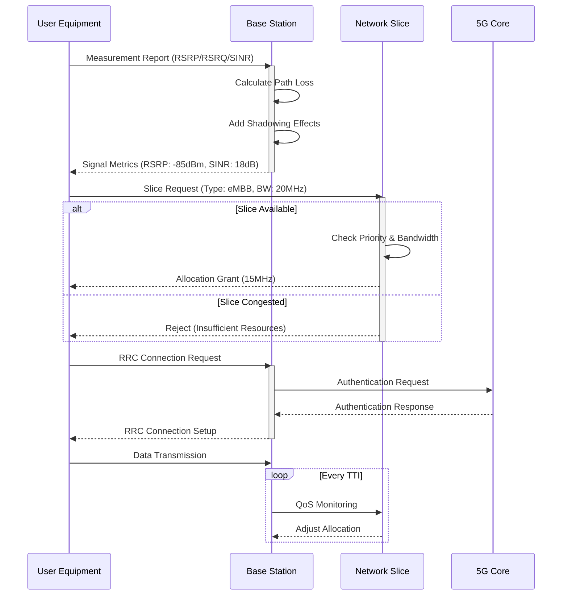

# 5G Network Simulation

## 📌 Overview

This C++ project simulates a 5G network environment with multiple base stations, network slices, and user equipment (UE) instances. The simulation models key aspects of 5G networks including radio signal propagation, network slicing, dynamic resource allocation, and UE mobility.

## 🚀 Features
| Feature | Description |
|---------|-------------|
| **Base Station (gNB) modeling** | with configurable parameters |
| **Network slicing** | for eMBB, URLLC, and mMTC services |
| **Realistic signal propagation** | with path loss and shadowing |
| **Dynamic UE movement** | and connection management |
| **Resource allocation** | based on slice priorities |
| **Multi-threaded simulation** | for concurrent connection attempts |

## Prerequisites
- C++17 compatible compiler (GCC, Clang, or MSVC)
- CMake 3.12+ (recommended)
- Basic understanding of 5G network concepts

## Build Instructions

### Using CMake (recommended)
```bash
mkdir build
cd build
cmake ..
make
```

## 🏗️ System Architecture

## System Architecture


## Key Components
### BaseStation Class
-Represents a 5G base station (gNB) with specific location and transmission characteristics
-Calculates signal metrics (SINR, RSRP, RSSI) for UEs
-Implements urban macro path loss model (3GPP TR 38.901

### NetworkSlice
-Represents logical network slices
-Handles resource allocation based on priority
-Supports three slice types: eMBB, URLLC, mMTC

### UserEquipment
-Simulates mobile devices with movement
-Implements connection logic and requirements
-Manages slice-specific QoS needs

### FiveGNetwork
-Orchestrates the overall simulation
-Coordinates interactions between components
-Provides simulation status reporting

 ### Technical Details
-Signal Propagation: Uses 3GPP Urban Macro path loss model
-Resource Allocation: Priority-based weighted fair queuing
-Concurrency: Thread-safe connection attempts
-Randomness: Mersenne Twister PRNG for realistic variations

## Key Relationships
### FiveGNetwork orchestrates all components

### BaseStations contain multiple NetworkSlices

### UserEquipment connects to:
One **BaseStation** (serving cell)    
One **NetworkSlice** (service type)

## Connection Signal Flow



